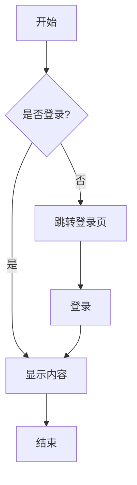
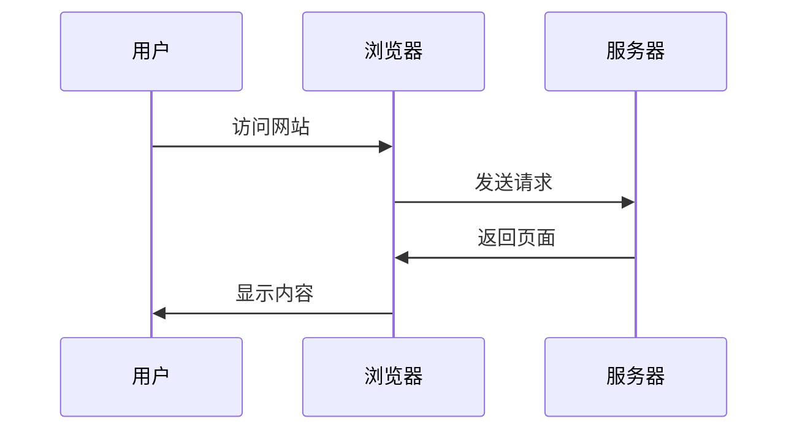

# Markdown 渲染示例

欢迎使用这个极简风格的 Markdown 静态站点。

## 功能特性

这个站点支持以下功能：

- **Markdown 渲染**：使用 marked 库
- **代码高亮**：使用 highlight.js
- **Mermaid 图表**：支持流程图、序列图等
- **响应式设计**：自适应手机端和桌面端
- **极简风格**：清爽的阅读体验

## 代码高亮示例

### JavaScript

```javascript
function greet(name) {
  console.log(`Hello, ${name}!`);
  return `Welcome to the site`;
}

const result = greet('World');
```

### Python

```python
def fibonacci(n):
    if n <= 1:
        return n
    return fibonacci(n-1) + fibonacci(n-2)

# 计算前10个斐波那契数
for i in range(10):
    print(fibonacci(i))
```

### HTML

```html
<!DOCTYPE html>
<html lang="zh-CN">
<head>
    <meta charset="UTF-8">
    <title>示例页面</title>
</head>
<body>
    <h1>Hello World</h1>
</body>
</html>
```

## Mermaid 图表示例

### 流程图



### 序列图



## 列表示例

### 无序列表

- 第一项
- 第二项
  - 子项 1
  - 子项 2
- 第三项

### 有序列表

1. 首先做这个
2. 然后做那个
3. 最后完成

## 引用

> 这是一段引用文本。
> 
> 可以包含多行内容。

## 表格

| 特性 | 支持 | 说明 |
|------|------|------|
| Markdown | ✅ | 完整支持 |
| 代码高亮 | ✅ | 使用 highlight.js |
| Mermaid | ✅ | 支持多种图表 |
| 响应式 | ✅ | 移动端友好 |

## 行内代码

使用 `npm install` 安装依赖，然后运行 `npm run dev` 启动开发服务器。

!!! note
    This is a note admonition.
!!!

---

这就是一个完整的示例页面！