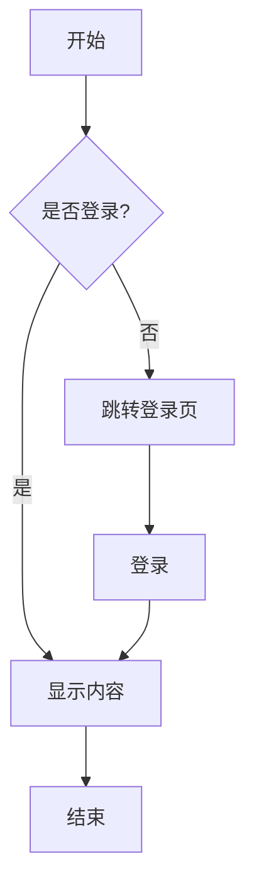
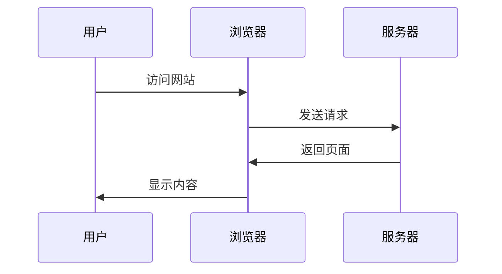

# Markdown 渲染示例

欢迎使用这个极简风格的 Markdown 静态站点。

## 功能特性

这个站点支持以下功能：

- **Markdown 渲染**：使用 marked 库
- **代码高亮**：使用 highlight.js
- **Mermaid 图表**：支持流程图、序列图等
- **响应式设计**：自适应手机端和桌面端
- **极简风格**：清爽的阅读体验

## 代码高亮示例

### JavaScript

```javascript
function greet(name) {
  console.log(`Hello, ${name}!`);
  return `Welcome to the site`;
}

const result = greet('World');
```

### Python

```python
def fibonacci(n):
    if n <= 1:
        return n
    return fibonacci(n-1) + fibonacci(n-2)

# 计算前10个斐波那契数
for i in range(10):
    print(fibonacci(i))
```

### HTML

```html
<!DOCTYPE html>
<html lang="zh-CN">
<head>
    <meta charset="UTF-8">
    <title>示例页面</title>
</head>
<body>
    <h1>Hello World</h1>
</body>
</html>
```

## Mermaid 图表示例

### 流程图



### 序列图



## 列表示例

### 无序列表

- 第一项
- 第二项
  - 子项 1
  - 子项 2
- 第三项

### 有序列表

1. 首先做这个
2. 然后做那个
3. 最后完成

## 引用

> 这是一段引用文本。
> 
> 可以包含多行内容。

## 表格

| 特性 | 支持 | 说明 |
|------|------|------|
| Markdown | ✅ | 完整支持 |
| 代码高亮 | ✅ | 使用 highlight.js |
| Mermaid | ✅ | 支持多种图表 |
| ECharts | ✅ | 支持各种数据图表 |
| 响应式 | ✅ | 移动端友好 |

## 行内代码

使用 `npm install` 安装依赖，然后运行 `npm run dev` 启动开发服务器。

## 数学公式

行内公式：质能方程 $E = mc^2$，欧拉公式 $e^{i\pi} + 1 = 0$。

块级公式：

$$
\int_{-\infty}^{\infty} e^{-x^2} dx = \sqrt{\pi}
$$

$$
\frac{\partial^2 u}{\partial t^2} = c^2 \nabla^2 u
$$

$$
\sum_{n=1}^{\infty} \frac{1}{n^2} = \frac{\pi^2}{6}
$$

## ECharts 图表示例

在代码块中使用 `echarts` 语言标识，内容为 ECharts 的 JSON 配置（支持可选字段 `_height` 设置高度，默认 400px）。

### 折线图

```echarts
{
  "title": { "text": "月度访问量" },
  "tooltip": { "trigger": "axis" },
  "xAxis": { "type": "category", "data": ["1月","2月","3月","4月","5月","6月"] },
  "yAxis": { "type": "value" },
  "series": [{
    "name": "访问量",
    "type": "line",
    "smooth": true,
    "data": [820, 932, 901, 934, 1290, 1330],
    "areaStyle": {}
  }]
}
```

### 柱状图

```echarts
{
  "title": { "text": "各地区销售额" },
  "tooltip": {},
  "xAxis": { "data": ["北京","上海","广州","深圳","杭州","成都"] },
  "yAxis": {},
  "series": [{
    "name": "销售额",
    "type": "bar",
    "data": [5000, 7200, 6100, 8300, 4900, 5600]
  }]
}
```

### 饼图

```echarts
{
  "_height": 350,
  "title": { "text": "流量来源", "left": "center" },
  "tooltip": { "trigger": "item" },
  "legend": { "orient": "vertical", "left": "left" },
  "series": [{
    "name": "来源",
    "type": "pie",
    "radius": "60%",
    "data": [
      { "value": 1048, "name": "搜索引擎" },
      { "value": 735, "name": "直接访问" },
      { "value": 580, "name": "邮件营销" },
      { "value": 484, "name": "联盟广告" },
      { "value": 300, "name": "视频广告" }
    ]
  }]
}
```

---

这就是一个完整的示例页面！